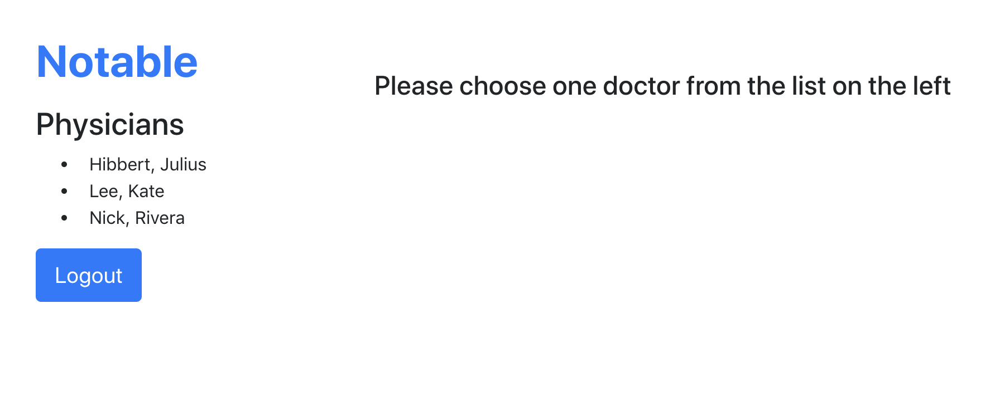

# Doctors Project

- Doctors Project is built with ReactJS. It shows calendars of physicians using the Notable platform to ensure they’re being imported correctly from the physician’s existing system of record.

### Screenshots

## Installation Instructions

1.API Server

- git clone `https://github.com/mavisluan/doctors_backend.git`
- cd doctors_backend
- yarn install
- yarn server

2.App

- git clone `https://github.com/mavisluan/doctors_frontend.git`
- cd doctors_frontend
- yarn install
- yarhn start
